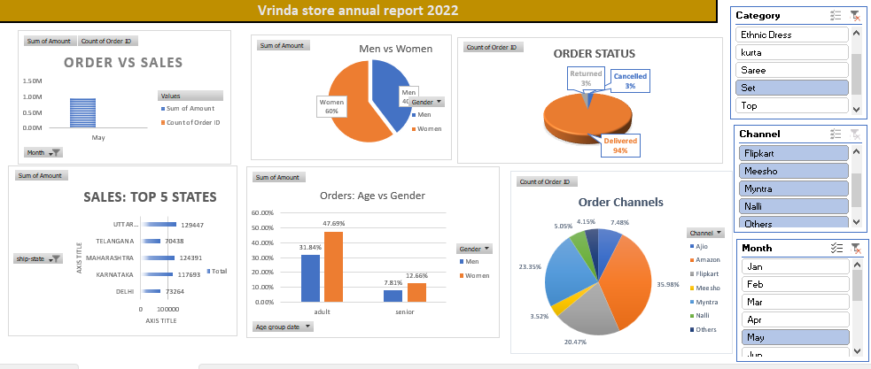
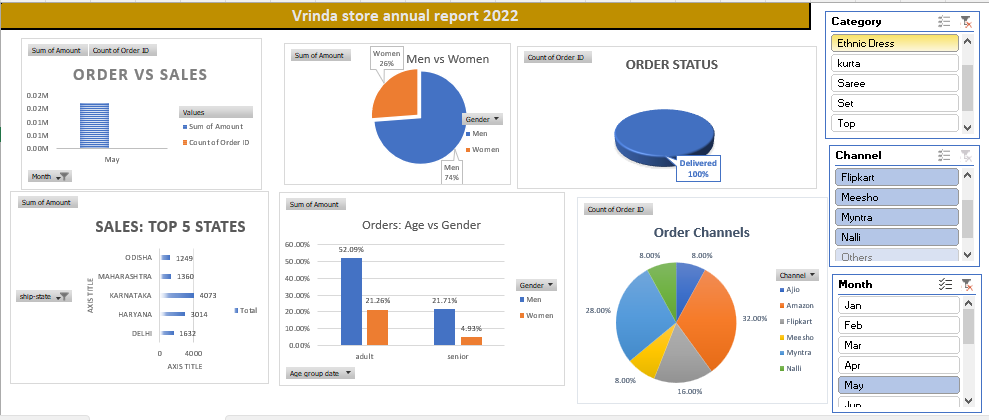
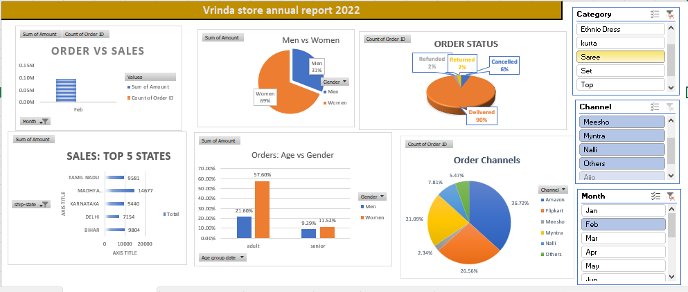

# Vrinda Store Data Analysis 📊

An Excel-based sales analysis project for Vrinda Store to understand trends, performance, and key metrics using charts, pivot tables, and slicers.

---

## 📌 Features

- 🧾 Monthly and Category-wise Sales Analysis
- 🌍 Region-wise Revenue Distribution
- 📈 Trend Charts & Pivot Reports
- 🎯 Summary Insights with Conditional Formatting
- 🔘 Slicers for Dynamic Filtering

---

## 🛠 Tools Used

- Microsoft Excel
- Pivot Tables, Charts, Conditional Formatting
- Data Cleaning with Functions

---

## 🖼️ Dashboard Screenshots

### 🔹 Sales Summary

### 🔹 Region-wise Sales

### 🔹 Category Trends

---

## 📂 Project Structure

